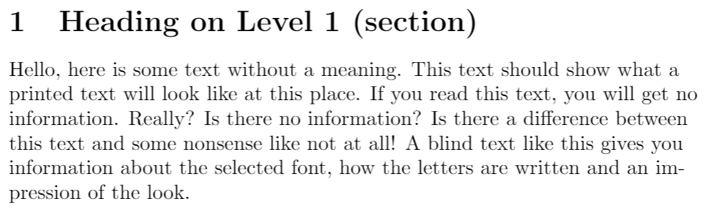

# text_recognizer
This is my first project of computer vision, here i'm trying to convert a text seen on an image to a string readable by our PC's.
Unfortunately i thought that the task was harder but the solution was very simple, however theese are the results.

You can notice that the library recognize very well an image with written-on-pc text but performs poorly with some handritten text.

## Handwritten texts

### first image

#### ouput of the script

### second image

#### ouput of the script

## written-on-pc text

### third image

#### ouput of the script

#Note
If you want to try the script you have to install the .exe file of the tesseract library at  https://github.com/UB-Mannheim/tesseract/wiki.
then put it in the parent folder of your project.
